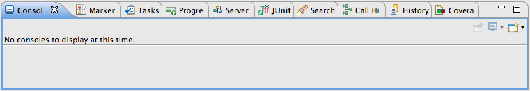

# State-of-the-art web application development with Java and Spring
Oliver Gierke
:revdate: {docdatetime}
:revremark: This work is licensed under a Creative Commons Attribution-NonCommercial-ShareAlike 4.0 International License.
:numbered:
:experimental:
:source-highlighter: prettify
:icons: font
:toc:

This documents summarizes the content of a lecture I held at TU Dresden in support of the Sofware Engineering Lab. It's primary goal is to ramp up the students with the very basics of Java web application development.

:numbered!:
[preface]
## Introduction

The fundamental goals of the lecture are:

* Learn how to create, setup and run a Spring-based Java web application.
* How to control the build and project dependencies using Maven.
* How to build Spring and Spring MVC based web applications.

The lecture content is three-fold: we're going to start by looking at the infrastructure prerequisites so that everyone is aware of what's going to be needed to follow the pratical examples. Based on that we're going to walk through a quickstart guide to give students a general idea of how to set up a new Spring (Boot) based Java web project. At this point we're not going to go into details but just see it working.

We're also going to have a look into details of Maven and the way it does dependency management as students will probably use other libraries than presented in the sample application and should also be able to set up a command line build (e.g for continuous integration).

Once that's done we're exploring more fundamental concepts when working with a Spring application, it's core concepts to understand what the Guestbook sample applicationfootnote:[Guestbook sample application -- https://github.com/st-tu-dresden/guestbook[GitHub repository]] consistes of. We're then going to cover aspects of Spring Data JPA to implement persistence and Spring MVC for the web layer.

To round things off, we're briefly discussing continuous integration to make sure the tests introduced in previous sections are continuously executed.

The source document for this script can be found in https://github.com/olivergierke/spring-webapps[this GitHub repository]. Feel free to create tickets for improvements or provide patches via pull requests.

:numbered:
## Infrastructure prerequisites

* JDK -> current version 8 (http://www.oracle.com/technetwork/java/javase/downloads/index.html[Download *SDK*])
* Maven (optional) -> to execute the build at the command line (for continuous integration, release builds) (http://maven.apache.org/download.cgi[Download])
* STS -> IDE, Spring flavored Eclipsefootnote:[Eclipse -- http://www.eclipse.org[Project website]], a standard Eclipse will do as well, but lacks some Spring-related support (https://spring.io/tools[Download])
* Git -> version control (http://git-scm.com/downloads[Download])

## Quickstart

### Objectives

* Learn how to create, setup and run a Java based web project
* Learn how to handle a web request
* Learn how to efficiently work with web related code

### Create a new project

.IDE centric style

1. Start STS.
2. Create a new project menu:File[New… > Other] (or kbd:[⌘+N]).
3. Select Spring Starter Project.
4. Keep settings (details on that below)
5. Select application aspects that you're interested in (e.g. Web).
6. Select btn:[Finish].

.Manual version

1. Browse to http://start.spring.io.
2. Keep settings (details on them below).
3. Select application aspects that you're interested in (e.g. Web).
4. Select btn:[Generate project].
5. Open up your IDE.
6. In Eclipse select menu:File[Import…].
7. Select "Existing Maven Projects".

.The result
The result should be a Java project created in the IDE looking something like this:

image::images/project.png[]

What do we have here?

* `Application.java` in `src/main/java` - The main (startable) application class.
* `static` / `templates` folders in `src/main/resources` - Folders for static resources and view templates.
* `application.properties` - Configuration file.
* `ApplicationTests.java` - Integration test to test the application.
* `pom.xml` - The POM (Project Object Model). A Maven configuration file to control project setup, build and depdencies.

### Add minimal functionality and run this thing

* Create a new class:
+
.A simple Spring MVC controller
====
[source, java]
----
@RestController
class WelcomeController {

    @RequestMapping("/welcome")
    String welcome() {
        return "Welcome";
    }
}
----
====

* Execute `Application.java` (kbd:[⌥+⌘+X],kbd:[J] or right click the class, menu:Run As[Java Application]).
* Browse to http://localhost:8080/welcome, should give you `Welcome`.

### Make this a bit more dynamic

TIP: If you run the application in debug mode, you can change method bodies on the fly without having to restart the app. We're going to use that mode going forward.

* Change the method signature of the controller method to this:
+
[source, java]
----
welcome(@RequestParam(value = "name", defaultValue = "World") String name)
----

* Restart the application in debug mode (kbd:[⇧+⌥+D],kbd:[J] or menu:Debug As[Java Application]).
* Browse to http://localhost:8080/welcome, output should be unchanged.
* Change the URI to http://localhost:8080/welcome?name=Java, doesn't have any effect yet.
* While the application is running, change the method body to:
+
[source, java]
----
return "Welcome ".concat(name).concat("!");
----

* Refresh the browser tab and the response should now adapt to changes of the `name` attribute.

## Project dependencies and project build

### Maven

* Open source project to build Java applications
* Command line execution and IDE integration (to see the output of Maven related IDE activities in the console view, open up the Maven console by clicking the icon with the plus in the upper right).
+

* `pom.xml` as the central build configuration file
+
.A sample `pom.xml`
====
[source, xml]
----
<?xml version="1.0" encoding="UTF-8"?>
<project xmlns="http://maven.apache.org/POM/4.0.0" xmlns:xsi="http://www.w3.org/2001/XMLSchema-instance"
	xsi:schemaLocation="http://maven.apache.org/POM/4.0.0 http://maven.apache.org/xsd/maven-4.0.0.xsd">
	<modelVersion>4.0.0</modelVersion>

	<groupId>org.test</groupId> <1>
	<artifactId>demo</artifactId>
	<version>0.0.1-SNAPSHOT</version>
	<packaging>jar</packaging> <2>

	<name>java-web-sample</name>
	<description>Demo project for Spring Boot</description>

	<parent> <3>
		<groupId>org.springframework.boot</groupId>
		<artifactId>spring-boot-starter-parent</artifactId>
		<version>1.1.8.RELEASE</version>
		<relativePath/>
	</parent>

	<properties> <4>
		<project.build.sourceEncoding>UTF-8</project.build.sourceEncoding>
		<start-class>demo.Application</start-class>
	</properties>

	<dependencies> <5>

		<dependency>
			<groupId>org.springframework.boot</groupId>
			<artifactId>spring-boot-starter-web</artifactId>
		</dependency>

		<dependency>
			<groupId>org.springframework.boot</groupId>
			<artifactId>spring-boot-starter-data-jpa</artifactId>
		</dependency>

		<dependency>
			<groupId>org.hsqldb</groupId>
			<artifactId>hsqldb</artifactId>
		</dependency>

		<dependency>
			<groupId>org.springframework.boot</groupId>
			<artifactId>spring-boot-starter-test</artifactId>
			<scope>test</scope>
		</dependency>
	</dependencies>

	<build> <6>
		<plugins>
			<plugin>
				<groupId>org.springframework.boot</groupId>
				<artifactId>spring-boot-maven-plugin</artifactId>
			</plugin>
		</plugins>
	</build>

</project>
----
<1> Project coordinates: group identifier, artifact identifier, version.
<2> Project packaging: reasonable values for web applications are `jar` (packaging as a so called fat-JAR) or `war` (deployable into an application server).
<3> Parent POM declaration (optional): we're using a Spring Boot parent pom here to benefit from predefined plugin declarations, version declarations for dependencies etc.
<4> Properties to customize general project setup.
<5> Project dependencies: libraries or sets of libraries the project will work with.
<6> Build plugins: plugins to customize the build behavior. In this case we're using the Spring Boot Maven plugin to let the build result in an executable JAR file.
====

* 3 main goals: general project setup, dependency management, execute build.

.General project setup

* Open `pom.xml`
* Alter the property for the Java version (`java.version`) to 1.8.

NOTE: Some changes (such as this one) need manual project refresh in Eclipse (kbd:[⌥+F5] or right-click the project, select menu:Maven[Update Project…]).

### Project build

* The project build includes a certain set of steps, called lifecycle phases.
* The most important ones are source compilation (both sources and test sources), test execution and application packaging.
* Maven defines a standard folder structure so that it's easier to find things:
** `src/main/java` - Production code.
** `src/main/resources` - Production configuration files and resources.
** `src/test/java` - Test code, tests to be executed have to be named `…Tests`.
** `src/test/resources` - Test configuration files and resources.
* To see that in action, simply call `mvn clean package` on the command line:
+
.Running a maven build
====
----
Serendipity:java-web-sample olivergierke $ mvn clean package
[INFO] Scanning for projects...
[INFO]
[INFO] ------------------------------------------------------------------------
[INFO] Building java-web-sample 0.0.1-SNAPSHOT
[INFO] ------------------------------------------------------------------------
[INFO]
[INFO] --- maven-clean-plugin:2.5:clean (default-clean) @ demo ---
[INFO] Deleting /Users/olivergierke/Documents/workspace/java-web-sample/target
[INFO]
[INFO] --- maven-resources-plugin:2.6:resources (default-resources) @ demo ---
[INFO] Using 'UTF-8' encoding to copy filtered resources.
[INFO] Copying 1 resource
[INFO] Copying 0 resource
[INFO]

// Compilation

[INFO] --- maven-compiler-plugin:3.1:compile (default-compile) @ demo ---
[INFO] Changes detected - recompiling the module!
[INFO] Compiling 2 source files to /Users/olivergierke/Documents/workspace/java-web-sample/target/classes
[INFO]
[INFO] --- maven-resources-plugin:2.6:testResources (default-testResources) @ demo ---
[INFO] Using 'UTF-8' encoding to copy filtered resources.
[INFO] skip non existing resourceDirectory /Users/olivergierke/Documents/workspace/java-web-sample/src/test/resources
[INFO]
[INFO] --- maven-compiler-plugin:3.1:testCompile (default-testCompile) @ demo ---
[INFO] Changes detected - recompiling the module!
[INFO] Compiling 1 source file to /Users/olivergierke/Documents/workspace/java-web-sample/target/test-classes
[INFO]

// Executing tests

[INFO] --- maven-surefire-plugin:2.15:test (default-test) @ demo ---
[INFO] Surefire report directory: /Users/olivergierke/Documents/workspace/java-web-sample/target/surefire-reports
…
Results :
Tests run: 1, Failures: 0, Errors: 0, Skipped: 0

// Packaging

[INFO]
[INFO] --- maven-jar-plugin:2.4:jar (default-jar) @ demo ---
[INFO] Building jar: /Users/olivergierke/Documents/workspace/java-web-sample/target/demo-0.0.1-SNAPSHOT.jar
[INFO]
[INFO] --- spring-boot-maven-plugin:1.1.8.RELEASE:repackage (default) @ demo ---
[INFO] ------------------------------------------------------------------------
[INFO] BUILD SUCCESS
[INFO] ------------------------------------------------------------------------
[INFO] Total time: 6.240s
[INFO] Finished at: Mon Oct 20 15:04:30 CEST 2014
[INFO] Final Memory: 23M/321M
[INFO] ------------------------------------------------------------------------
Serendipity-:java-web-sample olivergierke $
----
====

### Dependency management

* Logical definition of libraries that will be used by the project.
* Artifact coordinates `$groupId:$artifactId:$version`.

TIP: To see the current list of dependencies unfold the Maven Dependencies node in the project tree in Eclipse. Alternatively run `mvn dependency:list -Dsort` in on the command line.

* In the current state the output of the command should look something like this:

.Listing dependencies of a Maven project
====
----
Serendipity:java-web-sample olivergierke $ mvn dependency:list -Dsort
[INFO] Scanning for projects...
[INFO]
[INFO] ------------------------------------------------------------------------
[INFO] Building java-web-sample 0.0.1-SNAPSHOT
[INFO] ------------------------------------------------------------------------
[INFO]
[INFO] --- maven-dependency-plugin:2.8:list (default-cli) @ demo ---
[INFO]
[INFO] The following files have been resolved:
[INFO]    …
[INFO]    org.springframework.boot:spring-boot-autoconfigure:jar:1.1.8.RELEASE:compile
[INFO]    org.springframework.boot:spring-boot-starter-logging:jar:1.1.8.RELEASE:compile
[INFO]    org.springframework.boot:spring-boot-starter-test:jar:1.1.8.RELEASE:test
[INFO]    org.springframework.boot:spring-boot-starter-tomcat:jar:1.1.8.RELEASE:compile
[INFO]    org.springframework.boot:spring-boot-starter-web:jar:1.1.8.RELEASE:compile
[INFO]    org.springframework.boot:spring-boot-starter:jar:1.1.8.RELEASE:compile
[INFO]    org.springframework.boot:spring-boot:jar:1.1.8.RELEASE:compile
[INFO]    org.springframework:spring-aop:jar:4.0.7.RELEASE:compile
[INFO]    org.springframework:spring-beans:jar:4.0.7.RELEASE:compile
[INFO]    org.springframework:spring-context:jar:4.0.7.RELEASE:compile
[INFO]    org.springframework:spring-core:jar:4.0.7.RELEASE:compile
[INFO]    org.springframework:spring-expression:jar:4.0.7.RELEASE:compile
[INFO]    org.springframework:spring-test:jar:4.0.7.RELEASE:test
[INFO]    org.springframework:spring-web:jar:4.0.7.RELEASE:compile
[INFO]    org.springframework:spring-webmvc:jar:4.0.7.RELEASE:compile
[INFO]    org.yaml:snakeyaml:jar:1.13:runtime
[INFO]
[INFO] ------------------------------------------------------------------------
[INFO] BUILD SUCCESS
[INFO] ------------------------------------------------------------------------
[INFO] Total time: 0.943s
[INFO] Finished at: Mon Oct 20 14:57:38 CEST 2014
[INFO] Final Memory: 15M/309M
[INFO] ------------------------------------------------------------------------
Serendipity:java-web-sample olivergierke $
----
====

* To add a new library or a few of them, add a new `<dependency />` block to the POM.
* Currently the `<dependencies />` block only contains two starters, the one for web and the one for the testing libraries.
* The web one was added due to the checkbox we flagged when setting up the project.
* This means that we can add additional libraries by declaring the corresponding `<dependency />` blocks.
* Add the starter for JPA:
+
.Declaring a dependency to Spring Boot's JPA starter
====
[source, xml]
----
<dependency>
  <groupId>org.springframework.boot</groupId>
  <artifactId>spring-boot-starter-data-jpa</artifactId>
</dependency>
----
====

[NOTE]
====
Spring Boot will detect the JPA dependencies on the classpath and set up some default configuration for the persistence. Thus, if you try to run the application with that dependency added it will complain about a database missing. For now, add the following additional dependency to keep the application bootstrapable.

.Dependeny declaration for the HSQL in-memory database
[source, xml]
----
<dependency>
  <groupId>org.hsqldb</groupId>
  <artifactId>hsqldb</artifactId>
</dependency>
----
====

* Re-run `mvn dependency:list -Dsort`
+
.Listing Maven dependencies
====
----
Serendipity:java-web-sample olivergierke $ mvn dependency:list -Dsort
[INFO] Scanning for projects...
[INFO]
[INFO] ------------------------------------------------------------------------
[INFO] Building java-web-sample 0.0.1-SNAPSHOT
[INFO] ------------------------------------------------------------------------
[INFO]
[INFO] --- maven-dependency-plugin:2.8:list (default-cli) @ demo ---
[INFO]
[INFO] The following files have been resolved:
[INFO]    …
[INFO]    org.springframework.boot:spring-boot-autoconfigure:jar:1.1.8.RELEASE:compile
[INFO]    org.springframework.boot:spring-boot-starter-aop:jar:1.1.8.RELEASE:compile
[INFO]    org.springframework.boot:spring-boot-starter-data-jpa:jar:1.1.8.RELEASE:compile
[INFO]    org.springframework.boot:spring-boot-starter-jdbc:jar:1.1.8.RELEASE:compile
[INFO]    org.springframework.boot:spring-boot-starter-logging:jar:1.1.8.RELEASE:compile
[INFO]    org.springframework.boot:spring-boot-starter-test:jar:1.1.8.RELEASE:test
[INFO]    org.springframework.boot:spring-boot-starter-tomcat:jar:1.1.8.RELEASE:compile
[INFO]    org.springframework.boot:spring-boot-starter-web:jar:1.1.8.RELEASE:compile
[INFO]    org.springframework.boot:spring-boot-starter:jar:1.1.8.RELEASE:compile
[INFO]    org.springframework.boot:spring-boot:jar:1.1.8.RELEASE:compile
[INFO]    org.springframework.data:spring-data-commons:jar:1.8.4.RELEASE:compile
[INFO]    org.springframework.data:spring-data-jpa:jar:1.6.4.RELEASE:compile
[INFO]    org.springframework:spring-aop:jar:4.0.7.RELEASE:compile
[INFO]    org.springframework:spring-aspects:jar:4.0.7.RELEASE:compile
[INFO]    org.springframework:spring-beans:jar:4.0.7.RELEASE:compile
[INFO]    org.springframework:spring-context:jar:4.0.7.RELEASE:compile
[INFO]    org.springframework:spring-core:jar:4.0.7.RELEASE:compile
[INFO]    org.springframework:spring-expression:jar:4.0.7.RELEASE:compile
[INFO]    org.springframework:spring-jdbc:jar:4.0.7.RELEASE:compile
[INFO]    org.springframework:spring-orm:jar:4.0.7.RELEASE:compile
[INFO]    org.springframework:spring-test:jar:4.0.7.RELEASE:test
[INFO]    org.springframework:spring-tx:jar:4.0.7.RELEASE:compile
[INFO]    org.springframework:spring-web:jar:4.0.7.RELEASE:compile
[INFO]    org.springframework:spring-webmvc:jar:4.0.7.RELEASE:compile
[INFO]    org.yaml:snakeyaml:jar:1.13:runtime
[INFO]    xml-apis:xml-apis:jar:1.0.b2:compile
[INFO]
[INFO] ------------------------------------------------------------------------
[INFO] BUILD SUCCESS
[INFO] ------------------------------------------------------------------------
[INFO] Total time: 1.007s
[INFO] Finished at: Mon Oct 20 15:10:35 CEST 2014
[INFO] Final Memory: 16M/309M
[INFO] ------------------------------------------------------------------------
Serendipity:java-web-sample olivergierke $
----
====

* Note, how the list of dependencies changed and an entire set of new dependencies has been added due to the declaration of that single logical dependency.
* Spring Boot takes care of providing a consistent set of dependencies for fundamental application aspects. Also, it takes away the need to declare version numbers for those dependencies to make sure they work with each other.

## Spring application development

### Fundamental building blocks of a Spring application

* *Application code* -- code you write, e.g. the `WelcomeController` in the quick start example
* *Configuration* -- code to configure the application container. Declares references to infrastructure components (e.g. the database, security) and defines how application components are found:
+
.An example configuration class
====
[source, java]
----
@Configuration <1>
@EnableAutoConfiguration <2>
@ComponentScan <3>
class Application { … }
----
<1> Declares the class to be a configuration class.
<2> Enables Spring Boot's auto-configuration mechanism.
<3> Enables application component scanning for the package the current class resides in (tweakable through attributes omn the annotation).
====
* *The application container* - Started by `SpringApplication.run(…)` in the main method or using `@RunWith(…)` and `@SpringApplication` in test cases (see `ApplicationTests` in the quick start section), inspects the given configuration and starts a Spring `ApplicationContext`. What exactly that means is depending on the configuration as well as the classpath.

.Spring Boot auto-configuration
****
The `@EnableAutoConfiguration` annotation triggers Spring Boot's inspection of the classpath and application configuration to enable defaults. This causes the embedded web server being started (due to the web starter being a dependency) and the JPA infrastructure being configured (due to the JPA starter being a dependency).
****

### Running a Spring application

[[spring.bootstrap.standalone]]
#### Standalone

* From within the IDE it's sufficient execute the main application class.
* On the command line, run `mvn clean package` and run the JAR (Java application ARchive) using `java -jar target/*.jar`. You can basically take the JAR created by the build and run that on any machine that has Java installed.

[[spring.bootstrap.integration-tests]]
#### In integration tests

* Test cases are usually executed by an open-source library called http://junit.org[JUnit] which has both Maven and Eclipse integration.
* To bootstrap the application container in an integration test the test class has to look as follows:
+
.Bootstrapping the Spring container from an integration test
====
[source, java]
----
@RunWith(SpringJUnit4ClassRunner.class)
@SpringApplicationConfiguration(classes = Application.class)
class ApplicationTests { … }
----
====
* `@RunWith(…)` tells JUnit to give Spring the control over the test execution.
* `@SpringApplicationConfiguration` configures which configuration class shall be bootstrapped.

### Application components

* Application components are usually identified by an annotation that is either `@Component` or an annotation annotated with `@Component` in turn (e.g. `@Service`).

* The component classes are discovered at bootstrap time and a single instance is created.
+
.A simple application component
====
[source, java]
----
@Component
class MyApplicationComponent {}
----
====

* If a component needs other components to work with (e.g. the web controller needs access to the component implementing data access), the component required can be injected into the depending component by using a constructor annotated with `@Autowired`.
+
.A simple component with a dependency
====
[source, java]
----
@Component
class MyDependingComponent {

  private final MyApplicationComponent dependency;

  @Autowired
  public MyDependingComponent(MyApplicationComponent dependency) {
    this.dependency = dependency;
  }
}
----
====

* If a component depended on cann not be found in the container, an exception is thrown:
+
.A Spring exception indicating a component cannot be found
====
----
Caused by: org.springframework.beans.factory.NoSuchBeanDefinitionException: No qualifying bean of type [demo.MyApplicationComponent] found for dependency: expected at least 1 bean which qualifies as autowire candidate for this dependency. Dependency annotations: {}
    at o.s.b.f.s.DefaultListableBeanFactory.raiseNoSuchBeanDefinitionException(…:1118)
    at o.s.b.f.s.DefaultListableBeanFactory.doResolveDependency(…:967)
    at o.s.b.f.s.DefaultListableBeanFactory.resolveDependency(…:862)
    at o.s.b.f.s.ConstructorResolver.resolveAutowiredArgument(…:811)
    at o.s.b.f.s.ConstructorResolver.createArgumentArray(…:739)
    ... 42 common frames omitted
----
====

[NOTE]
====
When using STS, classes that are Spring components carry a little S-overlay on the icon:

image::images/sts-components.png[]
====

### Data access with Spring and JPA

#### Fundamentals of Java persistence

* Most commonly used type of persistent stores these days are relational databases.
* JPAfootnote:[Java Persistence API (JPA) - http://en.wikipedia.org/wiki/Java_Persistence_API[Wikipedia]] is a standard to define the aspects of mapping Java objects to relational database and how to store into the database and retrieve objects from it in turn.
* Most fundamental concepts are entities and repositories:footnote:[Domain Driven Design (DDD) -- http://en.wikipedia.org/wiki/Domain-driven_design[Wikipedia]]
** *Entity* - a domain concept with identity and a certain lifecycle (can be created, updated, deleted etc.).
** *Repository* - an application component simulating a collection of aggregate roots (a special kind of entity). Usually backed by some persistence mechanism.

#### Entity mapping

* Entity ytpes are equipped with JPA annotations to customize the mapping to the database, declaring ids etc.
+
.A sample JPA entity type
====
[source, java]
----
@Entity
public class GuestbookEntry {

  @Id
  @GeneratedValue
  private Long id;
  private String name, text;
  private Date date;

  …
}
----
====

#### Spring Data JPA

* Defines a programming model to ease the implementation of repositories.
* Support for CRUDfootnote:[Create, Read, Update, Delete (CRUD) -- http://en.wikipedia.org/wiki/Create,_read,_update_and_delete[Wikipedia]] operations, query methods, predicate executions.
+
.A sample repository interfac
====
[source, java]
----
interface Guestbook extends CrudRepository<GuestbookEntry, Long> {

  List<GuestbookEntry> findByName(String name);
}
----
====

* Interfaces are automatically detected by Spring Boot and can be `@Autowired` into clients.
* CRUD operations available through `CrudRepository`.
* Query methods follow a naming convention (see the http://docs.spring.io/spring-data/jpa/docs/current/reference/html/#repositories.query-methods.query-creation[reference documentation] for details).

##### Writing test cases

* Create an integration test class (see <<spring.bootstrap.integration-tests, the section on testing>> for fundamentals).
* Mark the test class with `@Transactional` to automatically roll back changes in the database after each test method.
* Set up sample data in an `@Before` method (will be executed for each test method execution).
* Autowire the repository into the test case and call methods on it.
+
.A sample integration test for a repository
====
[source, java]
----
import static org.hamcrest.CoreMatchers.*;
import static org.junit.Assert.*;

…

@RunWith(SpringJUnit4ClassRunner.class)
@SpringApplicationConfiguration(classes = Application.class)
@Transactional
public class GuestbookIntegrationTest {

    @Autowired Guestbook repository;

    @Test
    public void persistsGuestbookEntry() {

        GuestbookEntry entry = new GuestbookEntry("Yoda", "May the source be with you!");
        repository.save(entry);

        assertThat(repository.findAll(), hasItem(entry));
    }
}
----
====

### Spring MVC

#### MVC fundamentals

* Architectural pattern to implement user interfaces.footnote:[Model View Controller (MVC) Pattern -- http://en.wikipedia.org/wiki/Model%E2%80%93view%E2%80%93controller[Wikipedia]]

#### Spring MVC controllers

* A controller is the central concept within Spring MVC. Accepts requests, delegates to business logic and returns either a view name and model or an object to be marshalled as e.g. JSON or XML.
+
.A sample Spring MVC controller
====
[source, java]
----
@Controller <1>
class GuestbookController {

  @RequestMapping( <2>
    value = "/guestbook", method = RequestMethod.POST, headers = IS_AJAX_HEADER)
  String addEntry( <3>
    @RequestParam("name") String name, @RequestParam("text") String text, Model model) {

    model.addAttribute("entry", …); <4>
    model.addAttribute("index", …);
    return …;
  }

  @RequestMapping(value = "/guestbook/{id}", method = RequestMethod.DELETE)
  String removeEntry(@PathVariable Long id) { … }
}
----
<1> Declares the class as a controller (so that Spring MVC picks it up).
<2> `@RequestMapping` allows to bind requests (via path, HTTP method, headers etc.) to method executions.
<3> Annotations on method parameters allow to bind aspects of the request to the method execution: `@RequestParam`, `@PathVariable`. Some types are supported without annotations (see the http://docs.spring.io/spring/docs/current/spring-framework-reference/html/mvc.html#mvc-ann-arguments[reference documentation] for details).
====

* Controller methods return value depends on mode of operation:
** REST web service (you want to server JSON/XML): return a domain object, either annotate method with `@ResponseBody` or the controller with `@RestController`.
** A website (through a template engine): return a `String` and thus trigger view resolution (see next section).

#### Natural view templates with Thymeleaf

* http://www.thymeleaf.org/[Thymeleaf] is the state-of-the art template engine to render HTML views.
* Supports so called natural templating, i.e. the template is a valid (and viewable) HTML page that contains directives that trigger content replacement on rendering.
* Sample view in the Guestbook project: https://github.com/st-tu-dresden/guestbook/blob/master/src/main/resources/templates/guestbook.html[`guestbook.html`].
* Supports partial rendering by using a special view name syntax: `$viewName :: $fragmentName` (see the `th:fragment="entry"` in the guestbook template).

[[continuous-integration]]
## Continuous integration with Travis

* Create account at http://travis-ci.org[Travis] (it's free!).
* Look up your repository and activate the CI job.
* Add a `.travis.yml` file to the root of your project with the following content:
+
.A sample `.travis.yml` file to configure a Java build CI job
====
[source, yaml]
----
language: java
jdk:
  - oraclejdk8
----
====

* Push that change to the repository and watch Travis kicking off a build of your project.

:numbered!:
## Appendix

[appendix]
### Recommended guides

* https://spring.io/guides/gs/serving-web-content/[Serving web content with Spring MVC]
* https://spring.io/guides/gs/accessing-data-jpa/[Accessing relational data with JPA]
* https://spring.io/guides/gs/securing-web/[Securing a web application]

[appendix]
### General best practices

.Create work items (tickets) and reference the item from the commit message
This will allow you to trace which code has been written and changed for what reason.

.Don't check in untested code
Writing test cases will not only reduce the number of bugs you introduce while writing the code. It also will help you design the code so that it's easy to use as it's effectively the first client you write for your production code. Beyond that, test cases help you to be able to change your code and immediately see if your changes broke existing functionality.

.Run the build before you push your changes to the server
It's considered good practice to not break the build as you might block your team mates, if they update the code and all of a sudden cannot bootstrap the container anymore. Even better, set up continuous integration as described in <<continuous-integration>>.

[appendix]
### Resources

* https://github.com/st-tu-dresden/guestbook[The Guestbook sample application].
* http://docs.spring.io/spring-boot/docs/current-SNAPSHOT/reference/htmlsingle[Spring Boot reference documentation]
* http://docs.spring.io/spring-framework/docs/4.0.x/spring-framework-reference/htmlsingle[Spring Framework reference documentation]
* http://docs.spring.io/spring-data/jpa/docs/current/reference/html[Spring Data JPA reference documentation]
* https://spring.io/guides[Getting started guides]
* http://projects.spring.io/spring-boot[Spring Boot project home]

[appendix]
### License
image::https://i.creativecommons.org/l/by-nc-sa/4.0/88x31.png[link="http://creativecommons.org/licenses/by-nc-sa/4.0/"]