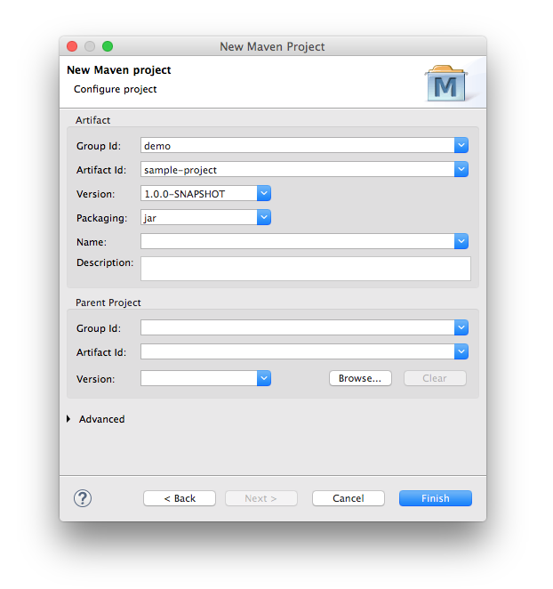
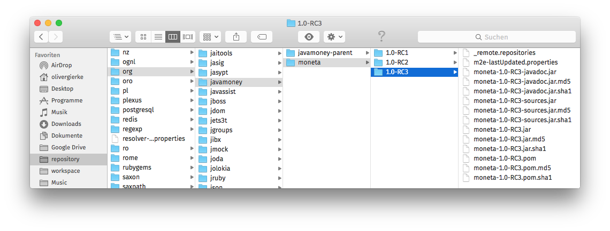
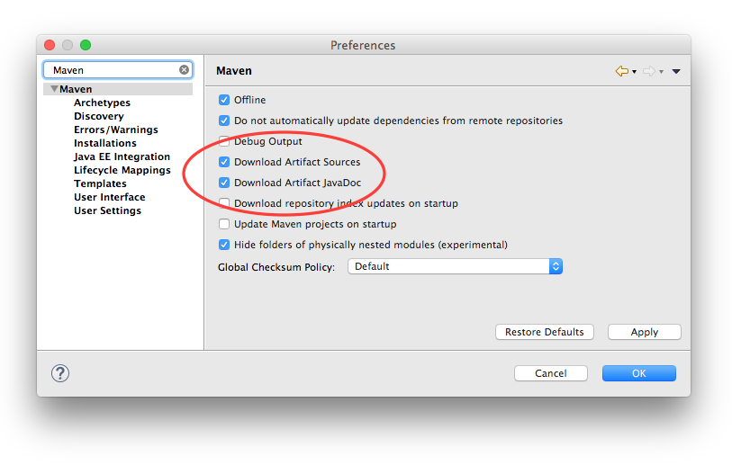
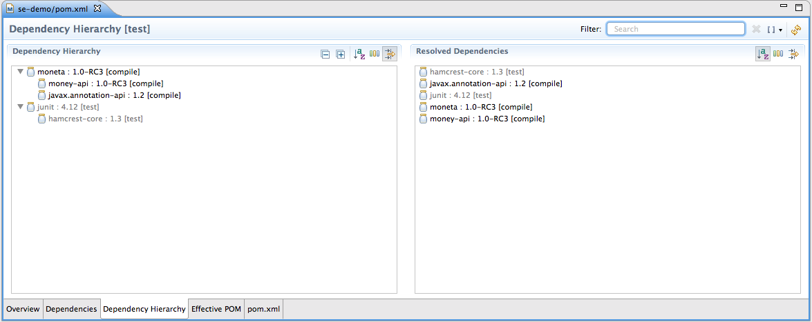

# Fundamentals of Java Development Tooling
Oliver Gierke
:revdate: {docdatetime}
:revremark: This work is licensed under a Creative Commons Attribution-NonCommercial-ShareAlike 4.0 International License.
:numbered:
:experimental:
:source-highlighter: prettify
:sectids!:
:sectanchors: true
:icons: font
:toc:
:livebase: http://static.olivergierke.de/lectures

image:https://travis-ci.org/olivergierke/lectures.svg?branch=master["Build Status", link="https://travis-ci.org/olivergierke/lectures"]

:numbered!:
[preface]
[[intro]]
## Introduction

This script should help you to get started with the fundamental tooling to support you when developing Java applications. Well cover the basic setup and usage of integrated development environments (IDEs) and build systems.

NOTE: Sections marked with this icon icon:lightbulb-o[] will define tasks that you should try yourself to get a better feel for the way things work.

[[intro.resources]]
### Resources

* https://github.com/olivergierke/lectures[Script repository] - in case you want to file tickets for improvements.
* link:{livebase}/java-tooling[Script] - the rendered version of it.

:numbered:
[[prerequisites]]
## Infrastructure prerequisites
* http://www.oracle.com/technetwork/java/javase/downloads/jdk8-downloads-2133151.html[JDK 8]
* https://eclipse.org/downloads/[Eclipse] / https://spring.io/tools/sts[STS] - Adds Spring Framework specific tooling
* http://maven.apache.org/download.cgi[Maven] (optional) -> to execute the build at the command line (for continuous integration, release builds)

[[quick-start]]
## Quick start

We're gonna create a new project within Eclipse here. This will be a Maven based project (see <<build.maven>>) for details.

1. Start Eclipse/STS.
2. Create a new Maven project.
+
* menu:File[New > Other…] or kbd:[⌘+N]
* type "Maven", select "Maven Project", btn:[Next]
* check "Create simple project", btn:[Next]
* enter group and artifact identifier, e.g. `demo` and `sample-project` (artifact identifier will become project name)
+

+
3. Create a Java class.
+
* Select `src/main/java`, kbd:[⌥+⌘+N], type `Class`, kbd:[⏎] or right-click, menu:New[Class]
* define a package of `demo`, type name `HelloWorld`

4. Add a main method.
+
[source, java]
----
public static void main(String... args) {
    System.out.println("Hello world!");
}
----

5. Run the class.
+
* Select the class in the project or package explorer (left column).
* kbd:[⌥+⌘+X], kbd:[J] or right-click, select menu:Run As[Java Application].
* see `Hello world!` printed to the console.

[[ide]]
## Eclipse

Eclipse is an integrated development environment (IDE). It's primarily used for Java development but can be equipped with plugins to develop software in other languages as well. Other IDEs available for Java development are https://www.jetbrains.com/idea/download/[IntelliJ IDEA] and https://netbeans.org/downloads/[Netbeans].

[[ide.advantages]]
### Advantages of using an IDE

* *Quick code base navigation* - IDEs allow you to navigate the code base in a semantic way by referring to types, methods, fields etc.
* *Code editing / refactoring* - Because the code you write is structurally and semantically analyzed, the IDE can help you write code quicker and avoid typing mistakes, manage the needed imports analyzing your classpath. Also changes to the code base can be executed in a way that the IDE makes sure they're applied consistently like method or field renames. Also, IDEs usually compile code on the fly and are even capable of partially compiling code bases. This provides instant feedback about programming mistakes.
+
Eclipse provides so called "Save actions" which -- as the name suggests -- are executed every time you save a source file. They allow you to automatically manage imports, apply certain formatting settings and tweak the code according to pre-defined rules.
* *Executing code* - IDEs allow you to run the application or parts of it right from within the IDE. This especially comes in handy when working with test cases.

[[ide.views-and-perspectives]]
### Views and perspectives

Core UI concepts are views that can be arranged in a certain way to make up a perspective.

* Open a view: menu:Window[Show view > Other…]
* Open a perspective: menu:Window[Open perspective > Other…]
* Switch between perspectives: kbd:[⌘+F8]

* Spring / Java perspective
** Project explorer (usually on the left side) - browse projects
** Editors - main screen, multiple tabs
** image:images/console_view.png[] Console - output of the program, Maven build information
** image:images/junit_view.gif[] JUnit - test results, test execution
* Debug perspective
** image:images/debug_view.gif[] Debug view - process information, stack
** image:images/variable_view.gif[] Variables - variable context at the current breakpoint
** image:images/breakpoints_view.gif[] Breakpoints - break points currently defined
** image:images/display_view.gif[] Display - live code execution within the current context

[[build]]
## Project build

Compiling a set of Java classes is usually not enough to actually run software in production. The application needs to be assembled, integration tested, documentation needs to be created, bundled and published. This is where build systems come into play.

A build system allows users to declare and configure individual elements of a build process. The predominant build systems in the Java space are https://maven.apache.org[Maven] and https://gradle.org/[Gradle]. Maven is currently the most widely used one although Gradle's been gaining a lot of traction recently. The latter is quite a bit more flexible when it comes to more advanced requirements in a project build. As we're not going to need this flexibility here we're going to stay with Maven for this lecture.

[[build.maven]]
### Maven

https://maven.apache.org[Maven] is currently the predominant tool to build Java based software projects. It's centered around the notion of a Project Object Model (POM) to describe the project, its dependencies and which steps shall be executed during the build.

[NOTE]
====
You can install Maven by either

* downloading it from the official https://maven.apache.org/download.cgi[website].
* with https://brew.sh[Homebrew] if you're using Mac OSX. Simply run `brew install maven` on the command line.
* or you favorite linux package manager (search for `maven`).
====

The build execution is backed by a so called https://maven.apache.org/guides/introduction/introduction-to-the-lifecycle.html[lifecycle] which is basically a predefined set of steps to be executed sequentially. Depending on the type of project that's being built a set of default plugins is assigned to the individual steps. Here's an incomplete list of the most important lifecycle phases:

* `compile` - compile sources (production and tests)
* `test` - execute test code (usually unit and fine grained integration tests)
* `package` - package the artifacts (JARs, WARs etc.)
* `integration-test` - execute high-level integration tests
* `install` - install the artifact into the local repository
* `deploy` - deploy the artifact into the remote repository, distribute resources

[TIP]
====
Open up the console and navigate to the folder you've created the quick start project in the first place. Make sure you've got Maven installed (see <<prerequisites>> for details). Run

[source, bash]
----
$ mvn clean package
[INFO] Scanning for projects...
[INFO]
[INFO] ------------------------------------------------------------------------
[INFO] Building sample-project 1.0.0-SNAPSHOT
[INFO] ------------------------------------------------------------------------
[INFO]
[INFO] --- maven-clean-plugin:2.5:clean (default-clean) @ sample-project ---
[INFO] Deleting …/se-demo/target
[INFO]
[INFO] --- maven-resources-plugin:2.6:resources (default-resources) @ sample-project ---
[WARNING] Using platform encoding (UTF-8 actually) to copy filtered resources, i.e. build is platform dependent!
[INFO] Copying 0 resource
[INFO]
[INFO] --- maven-compiler-plugin:3.3:compile (default-compile) @ sample-project ---
[INFO] Changes detected - recompiling the module!
[WARNING] File encoding has not been set, using platform encoding UTF-8, i.e. build is platform dependent!
[INFO] Compiling 1 source file to …/se-demo/target/classes
[INFO]
[INFO] --- maven-resources-plugin:2.6:testResources (default-testResources) @ sample-project ---
[WARNING] Using platform encoding (UTF-8 actually) to copy filtered resources, i.e. build is platform dependent!
[INFO] Copying 0 resource
[INFO]
[INFO] --- maven-compiler-plugin:3.3:testCompile (default-testCompile) @ sample-project ---
[INFO] Nothing to compile - all classes are up to date
[INFO]
[INFO] --- maven-surefire-plugin:2.12.4:test (default-test) @ sample-project ---
[INFO]
[INFO] --- maven-jar-plugin:2.4:jar (default-jar) @ sample-project ---
[INFO] Building jar: …/se-demo/target/sample-project-1.0.0-SNAPSHOT.jar
[INFO] ------------------------------------------------------------------------
[INFO] BUILD SUCCESS
[INFO] ------------------------------------------------------------------------
[INFO] Total time: 0.905 s
[INFO] Finished at: 2015-05-07T13:16:33+02:00
[INFO] Final Memory: 17M/305M
[INFO] ------------------------------------------------------------------------
$
----
====

If you'd like to see the build in action for a real-world project that produces a bit more output, you can try this (requires https://git-scm.com[Git] and Maven installed on your machine).

[source, bash]
----
$ git clone https://github.com/st-tu-dresden/guestbook
$ cd guestbook
$ mvn clean install
----

See the project build executed in the console, tests being executed.

[build.maven.configuration]
#### Build configuration

The build is configured using an XML document called `pom.xml` in the project root. It contains the artifact coordinates (see <<build.maven.dependency-management>> for details), project metadata, dependencies and build plugin configuration.

For the sample project we created above the `pom.xml` could look something like this:

[source, xml]
----
<project xmlns="http://maven.apache.org/POM/4.0.0"
         xmlns:xsi="http://www.w3.org/2001/XMLSchema-instance"
         xsi:schemaLocation="http://maven.apache.org/POM/4.0.0
                             http://maven.apache.org/xsd/maven-4.0.0.xsd">

  <modelVersion>4.0.0</modelVersion>

  <groupId>demo</groupId> <1>
  <artifactId>sample-project</artifactId>
  <version>1.0.0-SNAPSHOT</version>

  <dependencies> <2>

    …

  </dependencies>

  <build>
    <plugins>
      <plugin> <3>
        <groupId>org.apache.maven.plugins</groupId>
        <artifactId>maven-compiler-plugin</artifactId>
        <version>3.3</version>
        <configuration>
          <source>1.8</source>
          <target>1.8</target>
        </configuration>
      </plugin>
    </plugins>
  </build>

</project>
----
<1> Project artifact coordinates consisting of group and artifact identifier as well as a version.
<2> Definition of project dependencies.
<3> Configuration of a build plugin (configuring the Java compiler to use Java 8 here).

TIP: Open up the `pom.xml` you've created during the quick start, switch to the XML view and trigger code completion using kbd:[⌃+Space] to get a feel of the completion support the IDE provides.

IDEs support Maven out of the box and usually derive all necessary project settings from the POM. Thus changing something about the project is usually all about tweaking the POM and the refreshing the project setup using kbd:[⌥+F5] (or right-click, menu:Maven[Update Project…]).

TIP: Remove the compiler plugin declaration from the `pom.xml` and refresh the project. See how the JRE System Library node changes back to Java 1.5 (Maven's default). Re-add the plugin declaration, update again and see how it changes back to 1.8 due to our definition of source and target level.

[[build.maven.project-structure]]
#### Project structure

Maven defines a common project structure to make it easy to decide which files go where. By default Maven uses the following structure:

* `src/main/java` - Production code.
* `src/main/resources` - Production configuration files and resources.
* `src/test/java` - Test code, tests to be executed have to be named `…Tests`.
* `src/test/resources` - Test configuration files and resources.

[[build.maven.dependency-management]]
#### Dependency management

One of the primary factors of Java being the most widely used programming language in the world is the ecosystem of libraries available. Almost any kind of technical problem has an implemented solution available. So a Java application will - almost by definition - use quite a few of these already existing libraries.

In the early days of Java these libraries had to be manually downloaded, put into the project and bundled with the application. These days, build systems provide means to logically define the dependencies of an application and take care of resolving the physical artifacts and packaging them with the application. The artifacts are held in a so called repository, the primary one to refer to being http://search.maven.org/[Maven Central].

In a Maven project, dependencies are declared within a `<dependencies />` element in `pom.xml`:

.Declaring dependencies in a Maven POM
====
[source, xml]
----
<project xmlns="http://maven.apache.org/POM/4.0.0"
         xmlns:xsi="http://www.w3.org/2001/XMLSchema-instance"
         xsi:schemaLocation="http://maven.apache.org/POM/4.0.0
                             http://maven.apache.org/xsd/maven-4.0.0.xsd">

  …

  <dependencies>
    <dependency> <1>
      <groupId>org.javamoney</groupId>
      <artifactId>moneta</artifactId>
      <version>1.0-RC3</version>
    </dependency>
  </dependencies>

</project>
----
<1> Defines a dependency to the https://github.com/JavaMoney/jsr354-ri[Moneta] library.
====

A dependency is expressed by listing the group and artifact identifier alongside the version of the library. The exact coordinates and available versions can be found by looking up the artifact in the http://search.maven.org/[Maven Central index].

When the Maven build is run, the list of declared dependencies is consolidated and - if the physical artifacts are not available on the local machine already - obtained from the remote repository and stored in the local repository. The repository is located in `~/.m2/repository`.

.The structure of the local Maven repository
====

====

As you can see the group identifier is expanded into folders, followed by a folder for the artifact identifier and one for the version. The repository not only contains the binary Java Archive (JAR) but also additional JARs for containing the sources and JavaDoc.

[NOTE]
====
The sources and JavaDoc being present is caused by the IDE being configured to retrieve these additional artifacts. To enable this, check the Eclipse settings and enable "Download Artifact Sources" and "Download Artifact JavaDoc" in the section "Maven".

====

##### Transitive dependencies

Maven dependencies can of course in turn have dependencies themselves. This creates a tree of dependencies that will all be resolved by Maven automatically. To get an impression of the structure of dependencies, open the `pom.xml` in Eclipse and select the "Dependency hierarchy" tab at the bottom of the editor.

As you can see, Moneta depends on `money-api` and `javax.annotation-api` in turn and the dependencies have been resolved. Also, we've declared another dependency to JUnit in version 4.12. We defined it to be a test scope dependency. This means it will not be available when compiling production code. Also it will not be packaged with the application as it's not needed at runtime but only for the execution of tests.

[appendix]
[[appendix.shortcuts]]
## Keyboard shortcuts

### Code base navigation

* kbd:[⌘+⇧+T] - Open type (supports `*` and camel case lookups, e.g `ArLi` matches `ArrayList`)
* kbd:[⌘+⇧+R] - Open resource (like Open Type but also includes non-code source files)
* kbd:[⌘+O] - Outline (lists class methods and properties, type right away and hit btn:[Enter] to jump to the currently selected location).
* kbd:[⌘+T] - Show type hierarchy.
* kbd:[⌘+⇧+G] - Search for references in the workspace.
* kbd:[⌃+⌥+H] - Find code that calls the selected method.

### Code editing / refactoring

* kbd:[⌃+Space] - Code completion for methods, type names, variables
* kbd:[⌘+1] - Quick fix
* kbd:[⌘+D] - Delete line.
* kbd:[⌥+↑] - Move line up.
* kbd:[⌥+↓] - Move line down.
* kbd:[⌥+⌘+T] - Refactoring… (select menu item).
* kbd:[⌥+⌘+R] - Quick rename.

### Executing code

* kbd:[⌥+⌘+X] - eXecute…
** kbd:[J] - Java Application.
** kbd:[T] - Test case.
* kbd:[⌥+⇧+D] - Debug…
** kbd:[J] - Java Application.
** kbd:[T] - Test case.
* kbd:[⌘+⇧+F11] - eXecute last launch configuration.
* kbd:[⌘+F11] - Debug last launch configuration.

### Maven

* kbd:[⌥+F5] - Update project configuration

### Miscellaneous
** kbd:[⌘+3] - Quick access (to trigger almost any IDE functionality)

[appendix]
[[appendix.license]]
## License
image::https://i.creativecommons.org/l/by-nc-sa/4.0/88x31.png[link="http://creativecommons.org/licenses/by-nc-sa/4.0/"]
